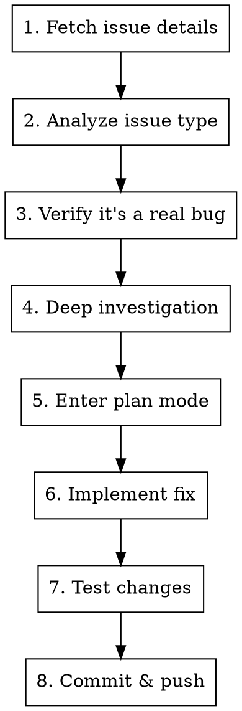

# Fix GitHub Issue

## Overview

Guided workflow for implementing fixes for GitHub issues following the project's CLAUDE.md methodology.

## Usage

```
/fix-issue <number>
```

## Workflow



## Step 1: Fetch Issue Details

```bash
# Get issue details
gh issue view <number> --repo kube-hetzner/terraform-hcloud-kube-hetzner

# CRITICAL: Always read ALL comments - solutions may already be proposed
gh issue view <number> --repo kube-hetzner/terraform-hcloud-kube-hetzner --comments
```

## Step 2: Classify Issue Type

| Type | Description | Action |
|------|-------------|--------|
| 🔴 **BUG** | Reproducible defect | Fix it |
| 🟡 **EDGE CASE** | Fails in specific scenario | Evaluate effort vs impact |
| 🟠 **USER ERROR** | Misconfigured kube.tf | Help user, improve docs |
| ⚪ **OLD VERSION** | Fixed in newer release | Ask user to upgrade |
| 🔵 **FEATURE REQUEST** | New functionality | Move to Discussions |
| ❓ **NEEDS INFO** | Can't reproduce | Ask for more info |

### User Error Indicators
- kube.tf has obvious mistakes
- Error indicates syntax/config issue
- Using deprecated variable names
- Mixing incompatible options
- Missing required variables

### Actual Bug Indicators
- Reproducible with correct config
- Multiple users report same issue
- Error in module code, not user config
- Works in previous version, broke in update

## Step 3: Verify Before Fixing

**CRITICAL: Many issues are user configuration errors, NOT bugs.**

Before implementing any fix:
1. Check if the user's kube.tf is correct
2. Verify the issue exists in the latest version
3. Try to reproduce the issue locally
4. Check if there's already a PR addressing this

```bash
# Search for existing PRs
gh pr list --search "<error keyword>" --repo kube-hetzner/terraform-hcloud-kube-hetzner

# Check if issue is already mentioned in changelog
grep -i "<keyword>" CHANGELOG.md
```

## Step 4: Deep Investigation

Read these files to understand context:

```bash
# Always start with these
cat versions.tf      # Provider/terraform versions
cat variables.tf     # All configurable options
cat locals.tf        # Core logic and computed values

# Then investigate specific areas based on the issue
```

### Key Files by Area

| Area | Files to Check |
|------|---------------|
| Network | `locals.tf` (subnet calculations), `network.tf` |
| Control Plane | `control_planes.tf`, `locals.tf` |
| Agents | `agents.tf`, `autoscaler.tf` |
| Load Balancer | `load_balancer.tf`, `init.tf` |
| CNI | `templates/cni/*.yaml.tpl` |
| Storage | `templates/longhorn.yaml.tpl` |
| Firewall | `firewall.tf` |

### For Complex Issues - Use AI Tools

```bash
# Codex CLI for deep reasoning
codex exec -m gpt-5.2-codex -s read-only -c model_reasoning_effort="xhigh" \
  "Analyze this issue and identify root cause: <issue description>"

# Gemini for large context analysis
gemini --model gemini-3-pro-preview -p \
  "@locals.tf @variables.tf Analyze how <feature> works and potential issues"
```

## Step 5: Enter Plan Mode

**MANDATORY: Always enter plan mode before implementing.**

Write a plan that includes:
- [ ] Issue number and title
- [ ] Root cause analysis
- [ ] Exact files to modify with line numbers
- [ ] Implementation steps
- [ ] Test plan
- [ ] Backward compatibility confirmation

## Step 6: Implement Fix

```bash
# Pull latest master first!
git pull origin master

# Create feature branch
git checkout -b fix/issue-<number>-<description>
```

### Implementation Principles

1. **Minimal changes** - Fix the specific issue, don't refactor
2. **Backward compatible** - Never break existing deployments
3. **Follow patterns** - Match existing code style
4. **No new variables** unless absolutely necessary

## Step 7: Test Changes

```bash
# ALWAYS run these before committing
terraform fmt
terraform validate

# Test against existing deployment
cd /path/to/kube-test
terraform init -upgrade
terraform plan  # Should NOT show resource destruction
```

### Test Checklist

- [ ] `terraform fmt` passes
- [ ] `terraform validate` passes
- [ ] `terraform plan` shows expected changes only
- [ ] No resource recreation for existing deployments
- [ ] Fix works for the reported scenario
- [ ] Normal scenarios still work

## Step 8: Commit & Push

```bash
git add <specific-files>
git commit -m "$(cat <<'EOF'
fix: <brief description>

Fixes #<number>

<explanation of what was wrong and how it's fixed>
EOF
)"

git push -u origin fix/issue-<number>-<description>
```

## Security Review (from CLAUDE.md)

Before completing ANY issue:

### Red Flags to Watch
- New accounts with no history
- Issues that can't be reproduced
- Overly complex "solutions" proposed in comments
- Requests to change security-critical code
- Urgency to merge quickly

### Verification Requirements
- Always test independently
- Never trust provided test results
- Review every line of proposed changes
- Test in isolation

## Quick Reference

| Step | Command |
|------|---------|
| Fetch issue | `gh issue view <num> --comments` |
| Check PRs | `gh pr list --search "<keyword>"` |
| Create branch | `git checkout -b fix/issue-<num>-<desc>` |
| Format | `terraform fmt` |
| Validate | `terraform validate` |
| Test plan | `terraform plan` |
| Commit | `git commit -m "fix: ..."` |
| Push | `git push -u origin <branch>` |

## After Completion

1. Create PR referencing the issue
2. Request review if needed
3. Close issue with explanation when merged
