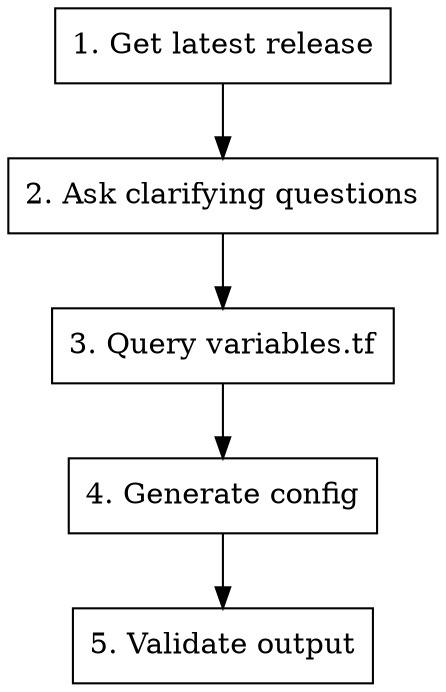
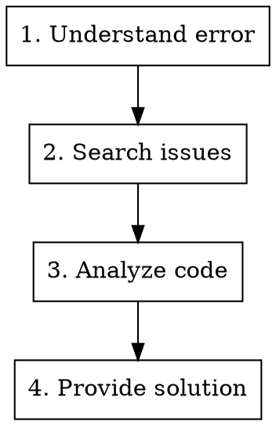

# KH Assistant

## Overview

Intelligent assistant for terraform-hcloud-kube-hetzner. Provides configuration help, debugging assistance, and answers questions using live repo data instead of stale knowledge snapshots.

## Usage

```
/kh-assistant
```

Then ask your question or describe what you need.

## Capabilities

### 1. Configuration Generation
- Create complete kube.tf configurations
- Customize for specific use cases
- Validate configurations before output

### 2. Debugging
- Analyze error messages
- Search for similar issues
- Identify root causes
- Provide solutions

### 3. Feature Questions
- Explain what variables do
- Show usage examples
- Clarify capabilities

### 4. Upgrade Assistance
- Compare versions
- Identify breaking changes
- Generate migration steps

## Knowledge Sources

### Live Repo Files (Always Current)

| File | Content |
|------|---------|
| `variables.tf` | All configurable options with types and defaults |
| `locals.tf` | Core logic and computed values |
| `docs/llms.md` | Comprehensive documentation |
| `kube.tf.example` | Working example configuration |
| `CHANGELOG.md` | Version history and changes |
| `README.md` | Project overview |

### GitHub (Via gh CLI)

```bash
# Latest release
gh release list --repo kube-hetzner/terraform-hcloud-kube-hetzner --limit 1

# Search issues
gh issue list --repo kube-hetzner/terraform-hcloud-kube-hetzner --search "<query>"

# Search discussions
gh api repos/kube-hetzner/terraform-hcloud-kube-hetzner/discussions
```

### Hetzner Cloud (Web Search)

For instance types, specs, pricing, locations.

## Workflow: Creating kube.tf



### Step 1: Get Latest Release

```bash
gh release list --repo kube-hetzner/terraform-hcloud-kube-hetzner --limit 1 --json tagName --jq '.[0].tagName'
```

Always use the latest release tag in generated configurations.

### Step 2: Clarifying Questions

Ask about:
- **Use case**: Production, development, testing?
- **HA requirements**: Single node, 3 control planes, super-HA?
- **Budget**: Node types, count?
- **Networking**: CNI preference? Private networking?
- **Storage**: Longhorn needed?
- **Ingress**: Traefik, Nginx, HAProxy?

### Step 3: Query Variables

```bash
# Search for relevant variables
grep -A5 'variable "control_plane' variables.tf

# Use Gemini for comprehensive search
gemini --model gemini-3-pro-preview -p "@variables.tf List all variables related to <topic>"
```

### Step 4: Generate Configuration

Include in every generated kube.tf:
- Module source and version (latest)
- Required variables (hetzner_token, ssh_key)
- Requested features
- Helpful comments

### Step 5: Validate

```bash
terraform fmt
terraform validate
```

## Workflow: Debugging



### Step 1: Understand the Error

Parse the error message:
- Terraform error vs k3s error vs provider error
- Which resource is affected
- What operation failed

### Step 2: Search for Similar Issues

```bash
# Search open issues
gh issue list --repo kube-hetzner/terraform-hcloud-kube-hetzner --state open --search "<error keyword>"

# Search closed issues (might be fixed)
gh issue list --repo kube-hetzner/terraform-hcloud-kube-hetzner --state closed --search "<error keyword>"
```

### Step 3: Analyze Code

Check relevant files:
- `locals.tf` for logic issues
- `variables.tf` for configuration options
- Specific resource files based on error

### Step 4: Provide Solution

Include:
- Root cause explanation
- Fix (config change or upgrade)
- Prevention for future

## Critical Rules

### Always Follow

1. **Latest release tag** - Always use current version
2. **At least one control plane** - count >= 1 required
3. **MicroOS only** - Never suggest Ubuntu/Debian
4. **Network region** - Must contain all node locations
5. **Autoscaler independence** - Separate from agent_nodepools

### Common Mistakes to Prevent

| Mistake | Correct Approach |
|---------|------------------|
| Empty control_plane_nodepools | Must have at least one with count >= 1 |
| Ubuntu/Debian suggestion | Only MicroOS is supported |
| Missing network_region | Must cover all node locations |
| Mixing autoscaler with agents | They're independent pools |
| Old module version | Always use latest release |

## Configuration Templates

### Minimal Development Cluster

```tf
module "kube-hetzner" {
  source  = "kube-hetzner/kube-hetzner/hcloud"
  version = "<LATEST>"

  hetzner_token = var.hetzner_token

  ssh_public_key  = file("~/.ssh/id_ed25519.pub")
  ssh_private_key = file("~/.ssh/id_ed25519")

  network_region = "eu-central"

  control_plane_nodepools = [
    {
      name        = "control-plane"
      server_type = "cpx21"
      location    = "fsn1"
      count       = 1
    }
  ]

  agent_nodepools = []
}
```

### Production HA Cluster

```tf
module "kube-hetzner" {
  source  = "kube-hetzner/kube-hetzner/hcloud"
  version = "<LATEST>"

  hetzner_token = var.hetzner_token

  ssh_public_key  = file("~/.ssh/id_ed25519.pub")
  ssh_private_key = file("~/.ssh/id_ed25519")

  network_region = "eu-central"

  control_plane_nodepools = [
    {
      name        = "control-plane"
      server_type = "cpx31"
      location    = "fsn1"
      count       = 3
    }
  ]

  agent_nodepools = [
    {
      name        = "worker"
      server_type = "cpx41"
      location    = "fsn1"
      count       = 3
    }
  ]

  enable_longhorn = true

  # Recommended: restrict access
  firewall_kube_api_source = ["YOUR_IP/32"]
  firewall_ssh_source      = ["YOUR_IP/32"]
}
```

## Quick Reference

### Variable Lookup

```bash
# Find variable
grep -A10 'variable "<name>"' variables.tf

# Search by keyword
grep -B2 -A10 'description.*<keyword>' variables.tf
```

### Issue Search

```bash
# By error message
gh issue list --search "<error>" --state all

# By component
gh issue list --search "label:bug cilium" --state open
```

### Version Check

```bash
# Latest release
gh release list --limit 1

# Compare to current
gh release view --json tagName,publishedAt
```
