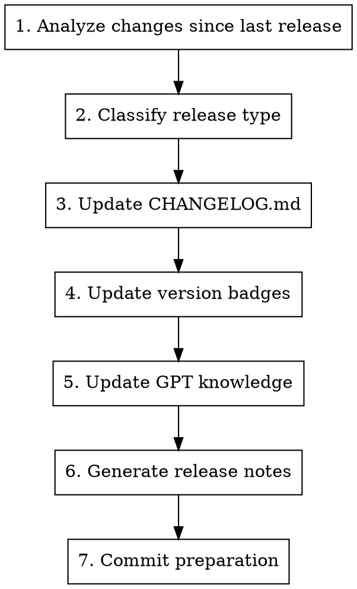

# Prepare Release

## Overview

Prepare a new release by generating changelog entries, updating version references, and creating release notes.

## Usage

```
/prepare-release
```

## IMPORTANT: Releases are Manual

**NEVER create release tags automatically.** The maintainer handles all releases manually.

Your job:
- Prepare the changelog
- Update version references
- Generate release notes draft
- Commit preparation changes

User's job:
- Create the actual tag
- Push the tag
- Create GitHub release

## Workflow



## Step 1: Analyze Changes

```bash
# Get latest release tag
LATEST=$(gh release list --repo kube-hetzner/terraform-hcloud-kube-hetzner --limit 1 --json tagName --jq '.[0].tagName')
echo "Latest release: $LATEST"

# List commits since last release
git log $LATEST..HEAD --oneline

# Get detailed changes
git log $LATEST..HEAD --pretty=format:"- %s (%h)"
```

Use Gemini for comprehensive analysis:

```bash
gemini --model gemini-3-pro-preview -p \
  "Analyze these git changes for a changelog. Categorize into: Features, Bug Fixes, Breaking Changes, Documentation. Ignore internal refactors.

$(git log $LATEST..HEAD --oneline)
$(git diff $LATEST..HEAD --stat)"
```

## Step 2: Classify Release Type

| Type | When | Example |
|------|------|---------|
| **PATCH** (x.x.X) | Bug fixes, docs, deps | 2.19.1 |
| **MINOR** (x.X.0) | New features, backward compatible | 2.20.0 |
| **MAJOR** (X.0.0) | Breaking changes | 3.0.0 |

### Breaking Change Indicators
- Variable removed or renamed
- Default value changes behavior
- Resource naming changes (causes recreation)
- Required migration steps

Use Codex for breaking change analysis:

```bash
codex exec -m gpt-5.2-codex -s read-only -c model_reasoning_effort="xhigh" \
  "Analyze these changes for breaking changes affecting existing deployments: $(git diff $LATEST..HEAD -- variables.tf locals.tf)"
```

## Step 3: Update CHANGELOG.md

### Changelog Format

```markdown
## [Unreleased]

### ⚠️ Upgrade Notes
<!-- Migration guides, breaking change warnings, special upgrade steps -->

### 🚀 New Features
<!-- New functionality added -->

### 🐛 Bug Fixes
<!-- Bugs that were fixed -->

### 🔧 Changes
<!-- Non-breaking changes, refactors, improvements -->

### 📚 Documentation
<!-- Documentation updates -->
```

### Writing Good Entries

- Write from user's perspective
- Include issue/PR references: `(#1234)`
- Be specific about what changed
- Include migration steps for breaking changes

### Example Entries

```markdown
### 🚀 New Features
- **K3s v1.35 Support** - Added support for k3s v1.35 channel (#2029)
- **NAT Router IPv6** - NAT router now supports IPv6 egress (#2015)

### 🐛 Bug Fixes
- Fixed autoscaler not respecting max_nodes limit (#2018)
- Resolved firewall rules not applying to new nodes (#2012)

### ⚠️ Upgrade Notes
- **NAT Router users**: Run `terraform apply` twice after upgrade due to route changes
```

## Step 4: Update Version Badges

Update README.md badges if version references changed:

```markdown
[](https://k3s.io)
```

Check `versions.tf` for:
- Terraform version requirement
- Provider version requirements
- K3s default channel

## Step 5: Update GPT Knowledge (if applicable)

If significant changes, regenerate the Custom GPT knowledge base:

```bash
# Run the knowledge generation script from CLAUDE.md
python3 << 'PYEOF'
# ... (script from CLAUDE.md)
PYEOF
```

Update `meta.version` in the script to match new release.

## Step 6: Generate Release Notes

### Release Notes Template

```markdown
## 🚀 Release vX.Y.Z

### Highlights

- **Feature 1**: Brief description
- **Feature 2**: Brief description

### ⚠️ Upgrade Notes

[Any special upgrade instructions]

### What's Changed

#### New Features
- Feature description (#PR)

#### Bug Fixes
- Fix description (#PR)

#### Other Changes
- Change description (#PR)

### Full Changelog

https://github.com/kube-hetzner/terraform-hcloud-kube-hetzner/compare/vPREV...vX.Y.Z

### Upgrade

\`\`\`tf
module "kube-hetzner" {
  source  = "kube-hetzner/kube-hetzner/hcloud"
  version = "X.Y.Z"
  # ...
}
\`\`\`

\`\`\`bash
terraform init -upgrade
terraform plan
terraform apply
\`\`\`
```

## Step 7: Commit Preparation

```bash
git add CHANGELOG.md README.md
git commit -m "$(cat <<'EOF'
chore: prepare release vX.Y.Z

- Update CHANGELOG.md with release notes
- Update version badges
EOF
)"
git push origin master
```

## After Preparation (User Does This)

```bash
# Create tag
git tag -a vX.Y.Z -m "Release vX.Y.Z"

# Push tag
git push origin vX.Y.Z

# Create GitHub release (or use gh CLI)
gh release create vX.Y.Z --title "vX.Y.Z" --notes-file release-notes.md
```

## Version Reference Locations

Files that may need version updates:

| File | What to Update |
|------|---------------|
| `README.md` | Badge versions |
| `CHANGELOG.md` | [Unreleased] → [vX.Y.Z] |
| `docs/llms.md` | Example version references |
| `kube.tf.example` | Version in comments |
| GPT knowledge | meta.version |

## Quick Checklist

- [ ] Commits analyzed since last release
- [ ] Release type determined (PATCH/MINOR/MAJOR)
- [ ] CHANGELOG.md updated
- [ ] Breaking changes documented with migration steps
- [ ] Version badges updated (if needed)
- [ ] Release notes drafted
- [ ] Changes committed and pushed
- [ ] Ready for maintainer to tag release
