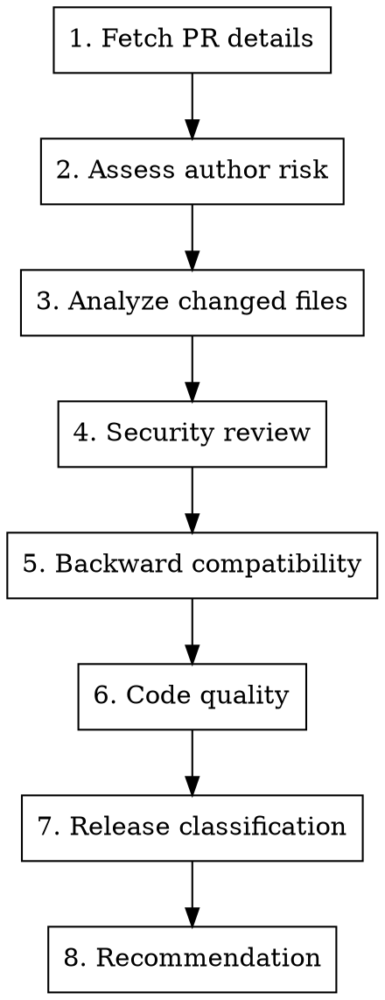

# Review Pull Request

## Overview

Security-focused PR review following CLAUDE.md guidelines. Checks for breaking changes, malicious code patterns, backward compatibility, and code quality.

## Usage

```
/review-pr <number>
```

## CRITICAL: Security Warning

**PRs can be malicious sabotage attempts.** This is a real threat documented in CLAUDE.md.

### Threat Awareness
- Coordinated attacks exist
- Competitors may actively harm the project
- Social engineering builds trust before attacking
- "Fixes" may introduce vulnerabilities

## Workflow



## Step 1: Fetch PR Details

```bash
# Get PR info
gh pr view <number> --repo kube-hetzner/terraform-hcloud-kube-hetzner

# Get diff
gh pr diff <number> --repo kube-hetzner/terraform-hcloud-kube-hetzner

# Get changed files
gh pr view <number> --repo kube-hetzner/terraform-hcloud-kube-hetzner --json files --jq '.files[].path'

# Get diff stats
gh pr view <number> --repo kube-hetzner/terraform-hcloud-kube-hetzner --json additions,deletions
```

## Step 2: Assess Author Risk

```bash
# Check account age
gh api users/<username> --jq '.created_at'

# Check prior contributions
gh pr list --author <username> --repo kube-hetzner/terraform-hcloud-kube-hetzner --state all --json number | jq length
```

### Risk Signals

| Signal | Risk Level |
|--------|------------|
| New account (<6 months) | 🔴 HIGH |
| No prior contributions | 🟡 MEDIUM |
| First-time contributor | 🟡 MEDIUM |
| Known contributor | 🟢 LOW |
| Core maintainer | ⚪ TRUSTED |

## Step 3: Analyze Changed Files

### Security-Critical Files (AUTO HIGH RISK)

```
init.tf              # Cluster initialization, secrets
firewall.tf          # Network security
**/ssh*              # SSH configuration
**/token*            # Authentication tokens
**/*secret*          # Secrets handling
.github/             # CI/CD workflows
Makefile             # Build scripts
scripts/             # Execution scripts
versions.tf          # Provider dependencies
templates/*.sh       # Shell scripts
cloud-init*          # Server initialization
```

### Risk by File Count

| Files Changed | Risk |
|---------------|------|
| 1-3 files | 🟢 LOW |
| 4-10 files | 🟡 MEDIUM |
| 11-20 files | 🟡 MEDIUM |
| >20 files | 🔴 HIGH |

### Risk by Diff Size

| Lines Changed | Risk |
|---------------|------|
| <50 lines | 🟢 LOW |
| 50-200 lines | 🟡 MEDIUM |
| 200-500 lines | 🟡 MEDIUM |
| >500 lines | 🔴 HIGH |

## Step 4: Security Review

### Checklist

- [ ] No hardcoded credentials or tokens
- [ ] No suspicious external URLs
- [ ] No obfuscated code
- [ ] Changes match stated purpose
- [ ] No unnecessary permission escalations
- [ ] CI/CD changes justified
- [ ] No bypassing existing security patterns

### Red Flags

| Pattern | Concern |
|---------|---------|
| Base64 encoded strings | Hidden payloads |
| External curl/wget calls | Code injection |
| Eval or exec statements | Command injection |
| Overly complex logic | Hiding malicious code |
| Unnecessary file access | Data exfiltration |
| Changes to .gitignore | Hiding tracks |

### Use AI for Deep Analysis

```bash
# Codex for security analysis
codex exec -m gpt-5.2-codex -s read-only -c model_reasoning_effort="xhigh" \
  "Analyze this PR diff for security vulnerabilities and malicious patterns: $(gh pr diff <num>)"

# Gemini for broad context
gemini --model gemini-3-pro-preview -p \
  "@locals.tf @init.tf Does this PR introduce any security concerns? $(gh pr diff <num>)"
```

## Step 5: Backward Compatibility

**CRITICAL: Any PR that causes resource recreation is a MAJOR release.**

### Breaking Change Indicators

- Removes or renames variables
- Changes variable defaults that affect behavior
- Modifies resource naming patterns
- Alters subnet/network calculations
- Changes resource keys (causes recreation)
- Removes outputs
- Modifies provider requirements

### Test for Breaking Changes

```bash
# Checkout PR locally
gh pr checkout <number>

# Test against existing cluster
cd /path/to/kube-test
terraform init -upgrade
terraform plan
```

**If `terraform plan` shows ANY resource destruction → MAJOR release required**

### Compatibility Checklist

- [ ] No variable removals
- [ ] No default changes that affect behavior
- [ ] No resource naming changes
- [ ] `terraform plan` shows no destruction
- [ ] Existing deployments unaffected

## Step 6: Code Quality

### Style
- [ ] Follows existing patterns
- [ ] Consistent naming
- [ ] Proper formatting (`terraform fmt`)
- [ ] No unnecessary complexity

### Logic
- [ ] Changes are correct
- [ ] Edge cases handled
- [ ] No regressions introduced
- [ ] Tests pass

## Step 7: Release Classification

### PATCH (x.x.PATCH)
- Bug fixes only
- No new features
- Fully backward compatible
- No terraform state impact

### MINOR (x.MINOR.0)
- New features (backward compatible)
- New optional variables with defaults
- Deprecation warnings (not removals)

### MAJOR (MAJOR.0.0)
- Breaking changes
- Removed/renamed variables
- Changed defaults affecting behavior
- State migrations required
- Resource recreations

## Step 8: Recommendation

### PR Review Output Template

```markdown
## PR Review: #<number>

**Title:** <title>
**Author:** @<username>
**Files:** <count> files changed (+<additions>/-<deletions>)

### Risk Assessment

| Factor | Value | Risk |
|--------|-------|------|
| Author tenure | X months | 🟢/🟡/🔴 |
| Prior contributions | N PRs | 🟢/🟡/🔴 |
| Files changed | N files | 🟢/🟡/🔴 |
| Lines changed | +X/-Y | 🟢/🟡/🔴 |
| Security-critical files | Yes/No | 🟢/🔴 |
| External dependencies | Yes/No | 🟢/🔴 |

**Overall Risk:** 🔴 HIGH / 🟡 MEDIUM / 🟢 LOW

### Security Review

- [ ] No hardcoded credentials
- [ ] No suspicious external URLs
- [ ] No obfuscated code
- [ ] Changes match stated purpose

### Backward Compatibility

- [ ] No breaking changes
- [ ] terraform plan shows no destruction
- [ ] Existing deployments unaffected

### Release Classification

**Type:** PATCH / MINOR / MAJOR
**Reason:** <explanation>

### Recommendation

**Action:** APPROVE / REQUEST CHANGES / CLOSE
**Notes:** <specific concerns or required changes>
```

## Quick Commands

```bash
# Approve PR
gh pr review <num> --approve --body "LGTM! ..."

# Request changes
gh pr review <num> --request-changes --body "Please address: ..."

# Comment
gh pr review <num> --comment --body "..."

# Merge (after approval)
gh pr merge <num> --squash --delete-branch
```

## Never Merge Directly to Master

All PRs go through staging branches first:

1. Create staging branch
2. Test thoroughly
3. Get AI review (Codex + Gemini)
4. Then merge to master
