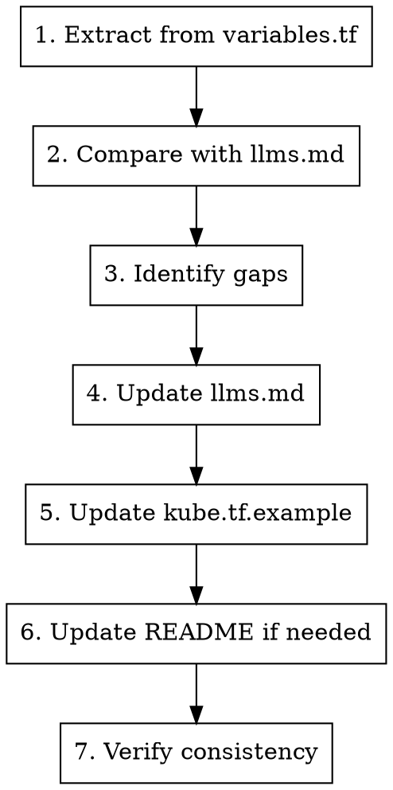

# Sync Documentation

## Overview

Ensure documentation is synchronized across all key files when variables or features change.

## Usage

```
/sync-docs
```

## Documentation Files

| File | Purpose | Priority |
|------|---------|----------|
| `variables.tf` | Source of truth for all variables | PRIMARY |
| `docs/llms.md` | Comprehensive variable reference | HIGH |
| `kube.tf.example` | Working example configuration | HIGH |
| `README.md` | Project overview and quick start | MEDIUM |
| `docs/terraform.md` | Auto-generated terraform docs | AUTO |

## Workflow



## Step 1: Extract Variables from Source

Use Gemini for large file analysis:

```bash
# List all variables from variables.tf
gemini --model gemini-3-pro-preview -p "@variables.tf List ALL variable names defined in this file, one per line"

# Get variable details
gemini --model gemini-3-pro-preview -p "@variables.tf For variable '<name>', provide: type, default, description"
```

## Step 2: Find Undocumented Variables

```bash
# Compare variables.tf with llms.md
gemini --model gemini-3-pro-preview -p \
  "@variables.tf @docs/llms.md List ALL variables from variables.tf that are NOT documented in llms.md. Output one per line."
```

## Step 3: Generate Documentation

### llms.md Format

```markdown
**Variable Name**

```tf
variable_name = "default_value"
```

* **`variable_name` (Type, Optional/Required):**
  * **Default:** `default_value`
  * **Purpose:** Clear explanation of what this does
  * **Usage:** When and how to use it
  * **Considerations:** Important notes, limitations, impacts
  * **Example:** Practical usage example if helpful
```

### kube.tf.example Format

```tf
  # Description of what this controls
  # Additional context if needed
  # variable_name = "default_value"
```

## Step 4: Update llms.md

For each undocumented variable:

1. Read variable definition from `variables.tf`
2. Understand its usage in `locals.tf` and other files
3. Write comprehensive documentation following the format above
4. Place in appropriate section of `llms.md`

### Section Organization in llms.md

| Section | Variables |
|---------|-----------|
| Cluster Basics | cluster_name, hetzner_token, ssh_* |
| Network | network_*, subnet_* |
| Control Plane | control_plane_* |
| Agents | agent_*, autoscaler_* |
| Load Balancer | lb_*, traefik_*, nginx_* |
| CNI | cni_*, cilium_*, calico_* |
| Storage | longhorn_* |
| Security | firewall_*, audit_* |
| Advanced | Additional/misc options |

## Step 5: Update kube.tf.example

Ensure new variables appear in the example with:
- Clear comment explaining purpose
- Commented out with default value
- Grouped with related variables

```bash
# Check what's in example vs variables.tf
gemini --model gemini-3-pro-preview -p \
  "@variables.tf @kube.tf.example List variables from variables.tf missing from kube.tf.example"
```

## Step 6: Update README if Needed

Update README.md if:
- New major feature added
- New CNI or ingress option
- Significant capability change

Features section should match actual capabilities.

## Step 7: Verify Consistency

```bash
# Final verification
gemini --model gemini-3-pro-preview -p \
  "@variables.tf @docs/llms.md @kube.tf.example Verify these files are consistent. List any discrepancies."
```

### Verification Checklist

- [ ] All variables.tf variables documented in llms.md
- [ ] All major variables appear in kube.tf.example
- [ ] README features match actual capabilities
- [ ] No typos in variable names across files
- [ ] Default values consistent across docs

## Common Sync Issues

### Variable renamed
1. Update in variables.tf
2. Search and replace in llms.md
3. Search and replace in kube.tf.example
4. Add to CHANGELOG.md (breaking change!)

### Variable removed
1. Remove from variables.tf
2. Remove from llms.md
3. Remove from kube.tf.example
4. Add to CHANGELOG.md (breaking change!)

### Default changed
1. Update in variables.tf
2. Update in llms.md
3. Update in kube.tf.example
4. Consider if this is a breaking change

## Quick Commands

```bash
# Regenerate terraform docs
terraform-docs markdown . > docs/terraform.md

# Search for variable across all docs
grep -r "variable_name" docs/ kube.tf.example README.md

# Find undocumented variables (quick check)
diff <(grep -oP 'variable "\K[^"]+' variables.tf | sort) \
     <(grep -oP '`\K[a-z_]+(?=`)' docs/llms.md | sort -u) | grep "^<"
```

## After Sync

1. Run `terraform fmt`
2. Commit with message: `docs: sync documentation with variables.tf`
3. If breaking changes, update CHANGELOG.md
