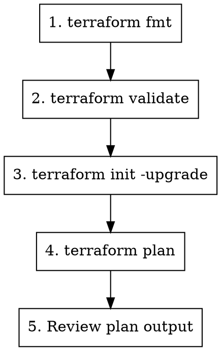

# Test Terraform Changes

## Overview

Run the standard validation suite for terraform changes against the test environment.

## Usage

```
/test-changes
```

## Test Environment

- **Module code:** `/Volumes/MysticalTech/Code/kube-hetzner`
- **Test cluster:** `/Users/karim/Code/kube-test`

## Workflow



## Step 1: Format Check

```bash
cd /Volumes/MysticalTech/Code/kube-hetzner
terraform fmt -recursive
```

**Must pass before proceeding.**

## Step 2: Validate Module

```bash
cd /Volumes/MysticalTech/Code/kube-hetzner
terraform validate
```

**Must pass before proceeding.**

## Step 3: Initialize Test Environment

```bash
cd /Users/karim/Code/kube-test
terraform init -upgrade
```

This picks up changes from the local module.

## Step 4: Plan Against Test Cluster

```bash
cd /Users/karim/Code/kube-test
terraform plan
```

### What to Look For

#### Good Signs
- Only expected resources change
- No unexpected additions/deletions
- Changes match your intended modifications

#### Red Flags (STOP!)

| Output | Meaning | Action |
|--------|---------|--------|
| `will be destroyed` | Resource recreation | **STOP** - Breaking change |
| `must be replaced` | Resource recreation | **STOP** - Breaking change |
| `forces replacement` | Resource recreation | **STOP** - Breaking change |
| Unexpected changes | Side effects | Investigate before proceeding |

### Breaking Change = MAJOR Release

If `terraform plan` shows ANY resource destruction on existing infrastructure:
1. **STOP** - This is NOT backward compatible
2. The change requires a MAJOR version bump
3. Migration guide is required
4. Consider alternative approaches first

## Step 5: Review Plan Output

### Checklist

- [ ] `terraform fmt` passes
- [ ] `terraform validate` passes
- [ ] `terraform plan` shows expected changes only
- [ ] No resource destruction
- [ ] No unexpected side effects
- [ ] Changes are backward compatible

## Quick Reference

```bash
# Full test sequence
cd /Volumes/MysticalTech/Code/kube-hetzner && \
terraform fmt -recursive && \
terraform validate && \
cd /Users/karim/Code/kube-test && \
terraform init -upgrade && \
terraform plan
```

## Apply (Optional)

Only if plan looks correct and you want to test on actual infrastructure:

```bash
cd /Users/karim/Code/kube-test
terraform apply
```

**Caution:** This modifies real infrastructure. Only do this for thorough testing.

## Common Issues

### "Provider version constraints"
```bash
terraform init -upgrade
```

### "Module source has changed"
```bash
terraform init -upgrade
```

### "State lock"
Someone else may be running terraform. Wait or:
```bash
terraform force-unlock <lock-id>
```

### Validation errors
Check the error message - usually points to:
- Missing required variable
- Type mismatch
- Invalid reference

## AI-Assisted Review

For complex changes, get AI review:

```bash
# Codex for correctness
codex exec -m gpt-5.2-codex -s read-only -c model_reasoning_effort="xhigh" \
  "Review these terraform changes for issues: $(git diff)"

# Gemini for broad impact
gemini --model gemini-3-pro-preview -p \
  "@locals.tf @variables.tf Analyze impact of these changes: $(git diff)"
```
