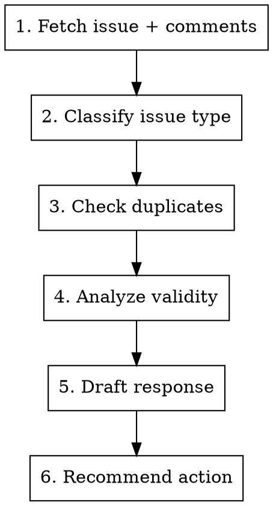

# Triage GitHub Issue

## Overview

Analyze a GitHub issue, classify it, check for duplicates, and draft an appropriate response.

## Usage

```
/triage-issue <number>
```

## Workflow



## Step 1: Fetch Issue Details

```bash
# Get full issue with comments
gh issue view <number> --repo kube-hetzner/terraform-hcloud-kube-hetzner --comments

# Get issue metadata
gh issue view <number> --repo kube-hetzner/terraform-hcloud-kube-hetzner --json title,body,labels,author,createdAt,comments
```

## Step 2: Classify Issue Type

### Issue Types

| Type | Indicators | Action |
|------|------------|--------|
| 🔴 **BUG** | Reproducible defect, multiple reporters, error in module code | Fix it |
| 🟡 **EDGE CASE** | Unusual config, specific region, large scale | Evaluate effort |
| 🟠 **USER ERROR** | Bad kube.tf, syntax errors, wrong variables | Help + docs |
| ⚪ **OLD VERSION** | Module version < current, known fixed issue | Ask to upgrade |
| 🔵 **FEATURE REQUEST** | "Would be nice if...", "Can you add..." | Discussions |
| 💬 **QUESTION** | Needs help, not a bug | Answer or docs |
| ❓ **NEEDS INFO** | Can't reproduce, missing details | Ask for info |

### Classification Checklist

- [ ] Module version specified?
- [ ] kube.tf provided (sanitized)?
- [ ] Error message included?
- [ ] Steps to reproduce clear?
- [ ] Recent (not stale >6 months)?

## Step 3: Check for Duplicates

```bash
# Search open issues for similar keywords
gh issue list --repo kube-hetzner/terraform-hcloud-kube-hetzner --state open --search "<keyword>"

# Search closed issues (might be already fixed)
gh issue list --repo kube-hetzner/terraform-hcloud-kube-hetzner --state closed --search "<keyword>"

# Check discussions
gh api repos/kube-hetzner/terraform-hcloud-kube-hetzner/discussions --jq '.[] | select(.title | test("<keyword>"; "i")) | {number, title}'
```

## Step 4: Security Analysis

**CRITICAL: Issues can be malicious sabotage attempts.**

### Red Flags (from CLAUDE.md)

| Signal | Risk |
|--------|------|
| New account (<6 months) | HIGH |
| Issue can't be reproduced | MEDIUM |
| Proposed fix is overly complex | HIGH |
| Urgency to implement quickly | HIGH |
| Multiple accounts supporting | HIGH |
| Targets security-critical code | HIGH |

### Verify Independently

- Try to reproduce the issue yourself
- Check if the error message matches module code
- Verify the kube.tf provided is valid
- Search for similar reports from other users

## Step 5: Draft Response

### For USER ERROR

```markdown
Hi @{author},

Thanks for reporting this. Looking at your configuration, the issue appears to be in your kube.tf:

[Specific explanation of what's wrong]

Here's the corrected configuration:

```tf
[correct code]
```

Let me know if this resolves it!
```

### For OLD VERSION

```markdown
Hi @{author},

This issue was fixed in version X.Y.Z. You're currently using [older version].

Please upgrade by changing your module version:

```tf
module "kube-hetzner" {
  source  = "kube-hetzner/kube-hetzner/hcloud"
  version = "X.Y.Z"
  # ...
}
```

Then run:
```bash
terraform init -upgrade
terraform plan
terraform apply
```

Let me know if the issue persists after upgrading!
```

### For NEEDS INFO

```markdown
Hi @{author},

Thanks for reporting this. To investigate further, could you please provide:

- [ ] Module version (check your kube.tf)
- [ ] Your kube.tf (sanitized - remove tokens/keys)
- [ ] Full error message
- [ ] Steps to reproduce

This will help us identify the root cause.
```

### For DUPLICATE

```markdown
Hi @{author},

This appears to be a duplicate of #{duplicate_number}.

[If fixed]: This was fixed in version X.Y.Z.
[If open]: We're tracking this in the linked issue.

Closing as duplicate. Feel free to add any additional context to #{duplicate_number}.
```

### For FEATURE REQUEST

```markdown
Hi @{author},

Thanks for the suggestion! This sounds like a feature request rather than a bug.

Could you please open a Discussion for this? That's where we track feature ideas and gather community input.

https://github.com/kube-hetzner/terraform-hcloud-kube-hetzner/discussions/new?category=ideas

I'll close this issue, but feel free to ping me in the discussion!
```

## Step 6: Recommend Action

| Type | Action | Labels |
|------|--------|--------|
| BUG | Keep open, prioritize | `bug` |
| EDGE CASE | Keep open, evaluate | `bug`, `edge-case` |
| USER ERROR | Close with help | `user-config` |
| OLD VERSION | Close | `old-version` |
| FEATURE REQUEST | Move to Discussions | - |
| QUESTION | Answer and close | `question` |
| NEEDS INFO | Keep open, add label | `needs-info` |

## Triage Output Template

```markdown
## Triage Summary: Issue #<number>

**Title:** <title>
**Author:** @<username>
**Created:** <date>

### Classification

**Type:** <BUG/EDGE CASE/USER ERROR/OLD VERSION/FEATURE/QUESTION/NEEDS INFO>
**Confidence:** HIGH/MEDIUM/LOW
**Reason:** <why this classification>

### Checklist

- [ ] Module version: <version or "not specified">
- [ ] kube.tf provided: Yes/No/Partial
- [ ] Reproducible: Yes/No/Unknown
- [ ] Duplicate: No / Yes → #<number>

### Analysis

<What's actually happening and why>

### Recommended Action

**Action:** <FIX/HELP USER/CLOSE/MOVE TO DISCUSSIONS/NEEDS INFO>
**Priority:** HIGH/MEDIUM/LOW
**Response:** <drafted response above>
```

## Quick Commands

```bash
# Add label
gh issue edit <num> --add-label "bug"

# Close issue
gh issue close <num> --comment "Closing because..."

# Close as not planned
gh issue close <num> --reason "not planned" --comment "..."

# Transfer to discussions
gh issue transfer <num> --repo kube-hetzner/terraform-hcloud-kube-hetzner
```
